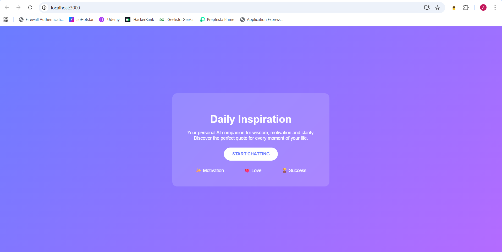
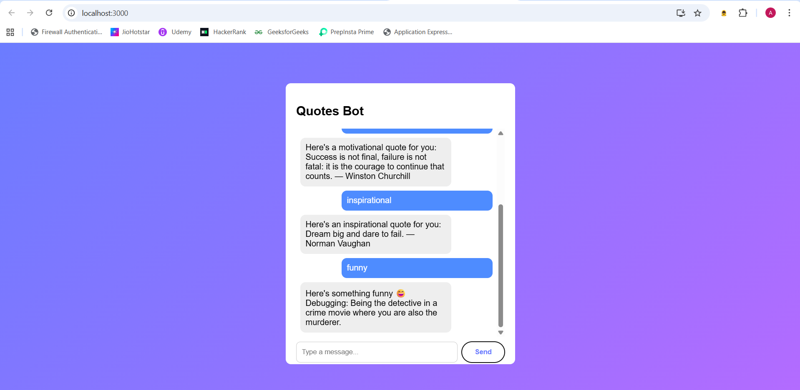
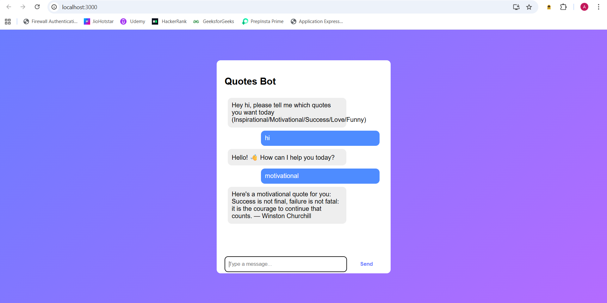

# Quotes Recommendation Chatbot 🤖✨

## 📌 Project Overview

The **Quotes Recommendation Chatbot** is an AI-powered conversational application built using the **Rasa framework**. The chatbot is designed to interact with users and provide meaningful responses in the form of **motivational, inspirational, funny, success-related, and greeting/farewell quotes**. The system understands user intent and responds accurately in real time through a web-based chat interface.

This project demonstrates the complete lifecycle of a chatbot, including **NLU training, dialogue management, testing, deployment, and validation**.

---

## 🎯 Objectives

* To design and implement an intelligent chatbot using Rasa
* To classify user intents accurately using Natural Language Understanding (NLU)
* To provide appropriate quote-based responses based on user input
* To deploy the chatbot using REST API and integrate it with a web-based UI
* To validate chatbot performance using automated testing and real-time interaction

---

## 🛠️ Technologies Used

* **Programming Language:** Python
* **Framework:** Rasa Open Source
* **Frontend:** HTML, CSS, JavaScript
* **Backend API:** Rasa REST API
* **Version Control:** Git & GitHub
* **Testing:** Rasa Test Stories and Rasa Shell

---

## 🧠 Features

* Greeting and farewell conversations
* Motivational quote recommendations
* Inspirational quote responses
* Funny quotes for entertainment
* Intent recognition using DIETClassifier
* Rule-based and story-driven dialogue management
* Web-based chatbot interface

---

## 📂 Project Structure

```
Quotes-Recommendation-Chatbot
│
├── actions.py
├── config.yml
├── domain.yml
├── endpoints.yml
├── requirements.txt
│
├── data
│ ├── nlu.yml
│ └── stories.yml
│
├── models
│
├── chatbot-ui
│ ├── public
│ ├── src
│ │ ├── App.js
│ │ └── App.css
│ └── package.json
│
├── screenshots
│ ├── landing-page.png
│ ├── chat-conversation.png
│ └── motivational-quote.png
│
└── README.md
```

---

## 🚀 How to Run the Project

### 1️⃣ Clone the Repository

```bash
git clone https://github.com/pragati-003/Quotes-Recommendation-Chatbot.git
cd Quotes-Recommendation-Chatbot
```

### 2️⃣ Create & Activate Virtual Environment

```bash
python -m venv venv
venv\Scripts\activate
```

### 3️⃣ Install Dependencies

```bash
pip install rasa
```

### 4️⃣ Train the Chatbot

```bash
rasa train
```

### 5️⃣ Run the Rasa Server

```bash
rasa run --enable-api --cors "*"
```

### 6️⃣ Launch Web Interface

* Open `web/index.html` in your browser
* Start chatting with the chatbot 🎉

---

## 🧪 Testing

* **Rasa Shell Testing:**

```bash
rasa shell
```

* **Automated Testing:**

```bash
rasa test
```

All test cases passed successfully, confirming correct intent recognition and response generation.

---

## 🌐 Deployment

The chatbot is deployed locally using the **Rasa REST API** and integrated with a **web-based UI**. Users can interact with the chatbot through a browser-based chat interface.

---

## 🎥 Demo

* **Demo Video:** [(Google Drive link added in SkillWallet)](https://drive.google.com/file/d/1emDkIpMabuXtK36-00WhbEfphVI7WBK9/view?usp=drive_link)
* **GitHub Repository:** [https://github.com/pragati-003/Quotes-Recommendation-Chatbot](https://github.com/pragati-003/Quotes-Recommendation-Chatbot)

---

## 📸 Screenshots

### Landing Page


### Chat Conversation


### Motivational Quote


Screenshots showing real-time chatbot conversations (greeting, motivation, inspiration, humor, and goodbye) are included as part of the project submission.

---

## ✅ Conclusion

The Quotes Recommendation Chatbot successfully demonstrates the use of Rasa for building intelligent conversational agents. The project fulfills all objectives by accurately recognizing user intents, delivering relevant responses, and providing a smooth user experience through a web-based interface. The chatbot was thoroughly tested and validated, ensuring reliability and correctness.

---

## 🙌 Acknowledgement

This project was developed as part of an academic/SkillWallet learning program to gain hands-on experience in chatbot development, NLP, and deployment.

---

## 👩‍💻👨‍💻 Author

* **Name:** Pragati Parmar
* **GitHub:** [https://github.com/pragati-003](https://github.com/pragati-003)

---

⭐ If you like this project, feel free to star the repository!
